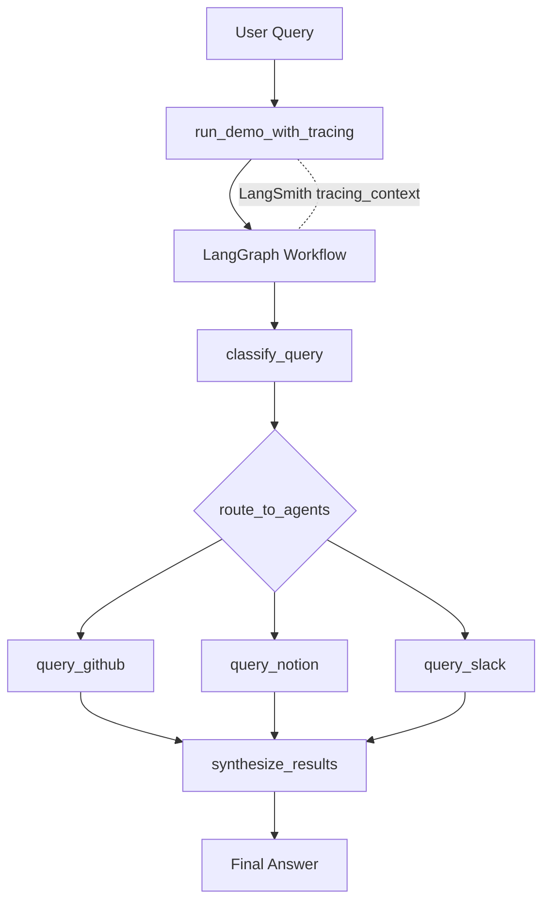

# Multi-Agents Router Knowledge Base

A portfolio project that demonstrates a **LangGraph-powered multi-agent router**.
The system takes one user question, routes it to the most relevant knowledge sources (GitHub, Notion, Slack), and synthesizes a final answer.

## Why This Project

Modern teams keep knowledge in multiple places. This project shows how to:

- classify a question into source-specific sub-questions
- fan out to specialized agents in parallel
- aggregate responses back into one concise answer
- keep the graph modular and maintainable

## Tech Stack

- Python 3.9+
- [LangGraph](https://github.com/langchain-ai/langgraph) for orchestration
- [LangChain](https://www.langchain.com/) for model/tool integration
- OpenAI chat models via `langchain-openai`
- [LangSmith](https://smith.langchain.com/) for tracing and observability
- `uv` for dependency and environment management
- `pytest` for unit tests

## Project Structure

```text
my_agent/
  agents.py            # Source-specific agent instances (GitHub/Notion/Slack)
  tools.py             # Tool functions each agent can call
  state.py             # Typed state for graph nodes
  router_prompts.py    # Classification + synthesis prompts
  router_schemas.py    # Structured output schema for classifier
  router_nodes.py      # Node logic (classify, query agents, synthesize)
  router_graph.py      # Graph construction and edges
  router_workflow.py   # Thin entrypoint / demo runner
```

## How It Works

1. **Classify**  
   A router LLM receives the original query and returns structured routing decisions (`classifications`).

2. **Route**  
   The graph sends source-specific sub-questions to relevant nodes with `Send(...)`.

3. **Query**  
   Each domain agent uses tools for its source context:
   - GitHub: code/issues/PR lookups
   - Notion: internal docs/pages
   - Slack: thread/discussion lookup

4. **Synthesize**  
   Results are merged into one final response for the user.

## Workflow Chart



## Setup

### 1) Install dependencies

```bash
uv sync
```

### 2) Add environment variables

Create `.env` in the project root:

```bash
OPENAI_API_KEY=your_openai_key
LANGSMITH_TRACING=true
LANGSMITH_ENDPOINT=https://api.smith.langchain.com
LANGSMITH_API_KEY=your_langsmith_key
LANGSMITH_PROJECT=multi-agents-router-knowledge-base
```

`OPEN_API_KEY` is also supported as an alias in `my_agent/agents.py`.

## Run

From project root:

```bash
uv run uvicorn app.main:app --reload --port 8082
```

Available endpoints:

- API root: `http://127.0.0.1:8082/`
- Health: `http://127.0.0.1:8082/api/healthz`
- Readiness: `http://127.0.0.1:8082/api/readyz`
- Swagger docs: `http://127.0.0.1:8082/docs`

Example query request:

```bash
curl -X POST "http://127.0.0.1:8082/api/query" \
  -H "Content-Type: application/json" \
  -d '{"query":"How do I authenticate API requests?"}'
```

## LangSmith Tracing

Tracing is enabled explicitly in `my_agent/router_workflow.py`:

- `run_demo()` is decorated with `@traceable(...)`
- `run_demo_with_tracing()` wraps execution in `tracing_context(...)`
- project name resolution order:
  - `LANGSMITH_PROJECT`
  - `LANGCHAIN_PROJECT`
  - fallback: `multi-agents-router-knowledge-base`

If traces are appearing under `default`, set `LANGSMITH_PROJECT` in `.env` and rerun.

## Testing

Run all tests:

```bash
uv run pytest -q
```

Current suite covers:

- classifier node structured output handling
- routing fan-out payloads (`Send`)
- per-source agent invocation normalization
- synthesis fallback and formatting logic
- workflow entrypoint and tracing wrapper behavior

## Architecture Notes (LangGraph-Oriented)

- **Single responsibility per file**: prompts, schemas, nodes, and graph wiring are split cleanly.
- **Typed state contract**: routing and result aggregation flow through `RouterState`.
- **Composable graph builder**: `build_router_workflow()` is reusable for scripts, tests, or APIs.
- **Node-level reuse**: shared helper for domain agent invocation avoids copy/paste logic.

## Portfolio Highlights

- Multi-agent routing design with structured output
- Parallel fan-out pattern in LangGraph
- Explicit LangSmith tracing integration with project-level grouping
- Environment-aware local setup with `uv` + `.env` + `.gitignore` protections
- Refactoring from monolithic workflow to modular graph architecture
- Offline-friendly test suite with mocked graph/LLM dependencies

## Next Improvements

- Convert `my_agent` to a package-safe import layout (`my_agent.*`) for both script and module execution styles.
- Add observability/tracing for node timings and token usage.
- Replace mock-style tool outputs with real GitHub/Notion/Slack API integrations.
